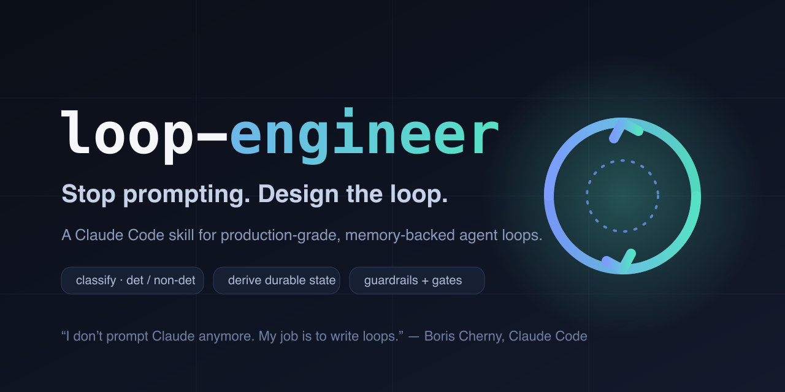

<div align="center">



# 🔁 loop-engineering

### A Claude Code skill that turns a rough idea into a production-grade agent **loop** — classified, scoped, memory-backed, and ready to run.

*Stop writing prompts. Start designing the system that writes them for you.*

[](https://github.com/victor-hac-work/loop-engineering-skills/actions/workflows/ci.yml)
[](./LICENSE)
[](https://claude.com/claude-code)


</div>

---

> **"I don't prompt Claude anymore. I have loops that are running. They're the ones that are prompting Claude and figuring out what to do. My job is to write loops."**
> — **Boris Cherny**, creator of Claude Code, Anthropic ([WorkOS Acquired Unplugged, June 2026](https://thenewstack.io/loop-engineering/))

That sentence is a paradigm shift. Prompt engineering was about crafting the perfect instruction. **Loop engineering** is about designing the *control system* that prompts the agent on a cadence, reads what it produced, decides whether it's done, and prompts again — until the goal is met or it escalates to a human.

The hard part isn't the loop. It's getting the **context, feedback, verification, termination, error handling, state, and budget** right — and giving the agent a **durable memory** that survives a context reset.

**`loop-engineering` is the skill that designs that for you.** You bring an idea; it interviews you, scans your harness, derives the right state, and emits a ready-to-run loop.

---

## ✨ What it does

You invoke the skill with a rough idea (*"keep my backend tests green"*, *"triage new issues every morning"*, *"sweep CI failures"*). It walks you through a short, gap-only dialogue and produces three things:

1. **A design doc** — `docs/loops-engineering/YYYY-MM-DD-<topic>.md` explaining the loop.
2. **Durable memory** — `docs/loops-engineering/memory/<topic>/` — the state spine the loop reads each pass.
3. **A ready-to-run prompt** — paste it into `/loop` (self-paced) or `/schedule` (on a cadence).

It never runs the loop itself. A **hard gate** keeps a human in the loop until you approve.

---

## 🧠 The model it reasons over

Loop engineering, distilled from [Boris Cherny](https://thenewstack.io/loop-engineering/), [Addy Osmani](https://addyosmani.com/blog/loop-engineering/), and [Cobus Greyling](https://github.com/cobusgreyling/loop-engineering), rests on three layers — with **memory** as the connective tissue.

### Six building blocks + Memory

| Block | Job in the loop |
|---|---|
| **Automations / Scheduling** | discovery + triage on a cadence |
| **Worktrees** | safe, isolated parallel execution |
| **Skills** | persistent project knowledge |
| **Plugins & Connectors (MCP)** | reach into your real tools |
| **Sub-agents** | maker / checker split |
| **+ Memory / State** | a durable spine outside any single conversation |

### The 5-step loop (every iteration)
`check state → decide → act → gather feedback → verdict`

### The 7 things to get right
context management · feedback quality · verification gates · termination condition · error handling · state across turns · cost / token budget

`loop-engineering` makes a real decision for **each** of these — instead of leaving them implicit.

---

## 🚀 Why this skill (and not a prompt template)

A loop template gives you a skeleton. `loop-engineering` gives you a **designed loop**:

- **It classifies first.** Deterministic (tests/build/lint exit 0) vs non-deterministic (fuzzy goal → it asks for the goal, and wires an **AI-as-judge** gate when no measurable check exists).
- **It scans your actual harness.** A bundled script discovers your installed **skills, sub-agents, MCP servers, and hooks** — so the design references tools you really have, not placeholders.
- **It derives memory from the goal.** No fixed `STATE.md` template. It critiques *your* goal and persists only what's needed to resume: a PR-babysitter tracks open PRs + last-seen SHA; a flaky-test triage tracks per-test verdicts; a migration tracks files done/remaining.
- **It separates "done" from "allowed."** A verification gate decides *done?*. **Guardrails** decide *allowed?* — forbidden paths, commands, and actions the loop must **never** cross.
- **It picks a run mode.** A cadence (`/loop 15m …` or a `/schedule` cron) or run-to-goal (self-paced `/loop`).
- **It self-reviews.** A loop-tuned reviewer subagent checks the design for missing termination, unreal check commands, dangling state files, and unenforceable guardrails before you ever see it.
- **It keeps you safe.** Phased rollout (L1 report-only → L2 assisted → L3 unattended), an explicit human gate, and a token budget — because loops are token-heavy.

---

## 📦 Install

### Quick install (Claude Code plugin marketplace) — recommended

Inside Claude Code, run:

```text
/plugin marketplace add victor-hac-work/loop-engineering-skills
/plugin install loop-engineering@loop-engineering-skills
```

That's it. The skill is model-invoked — Claude uses it automatically when you describe a
loop — or call it explicitly with `/loop-engineering:loop-engineering`.

To update later:

```text
/plugin marketplace update loop-engineering-skills
```

### Manual install (symlink into your skills dir)

```bash
git clone https://github.com/victor-hac-work/loop-engineering-skills.git
ln -s "$(pwd)/loop-engineering-skills/skills/loop-engineering" ~/.claude/skills/loop-engineering
```

### Try before installing

```bash
git clone https://github.com/victor-hac-work/loop-engineering-skills.git
claude --plugin-dir ./loop-engineering-skills
```

Requires: Claude Code, `bash`, `python3`, and (for the worktree option) `git`.

---

## 🛠 Usage

In Claude Code, just describe the loop you want:

```
Use loop-engineering to design a loop that keeps the backend test suite green.
```

The skill will:

1. **Scan** your harness (`scripts/scan-harness.sh`).
2. **Classify** the loop and, if fuzzy, ask for the goal.
3. **Walk the building blocks** — worktree vs current dir, which skills/sub-agents/MCP to use, maker/checker split.
4. **Ask for guardrails** (skippable).
5. **Ask for a schedule** (or skip → run to goal).
6. **Derive the state** and scaffold memory (`scripts/init-memory.sh`).
7. **Write the design doc**, self-review it, and present it.
8. On your approval, **emit the loop prompt + run instructions**.

Then you run it — `/loop <prompt>` or `/schedule`.

---

## 🗂 Repo layout

```
.claude-plugin/
  marketplace.json                    # marketplace catalog (this repo)
  plugin.json                         # the loop-engineering plugin manifest
skills/loop-engineering/
  SKILL.md                            # the dialogue flow + hard gate + checklist
  scripts/scan-harness.sh             # JSON: { skills, agents, mcp, hooks, gitWorktreeCapable }
  scripts/init-memory.sh              # scaffolds docs/loops-engineering/memory/<topic>/
  reference/loop-patterns.md          # the full model: blocks, 5-step, 7 things, rubric, skeleton
  reference/loop-design-reviewer.md   # loop-tuned self-review subagent prompt
assets/banner.svg|png                 # README banner / social preview
docs/design-spec.md                   # the design spec behind the skill
```

---

## 📚 Further reading

- [The New Stack — *The Anthropic leader who built Claude Code says he ditched prompting — now he just writes loops*](https://thenewstack.io/loop-engineering/)
- [Addy Osmani — *Loop Engineering*](https://addyosmani.com/blog/loop-engineering/)
- [Cobus Greyling — *Loop Engineering* (Substack)](https://cobusgreyling.substack.com/p/loop-engineering) · [GitHub](https://github.com/cobusgreyling/loop-engineering)
- [The Neuron — *Claude Code's Creators Explain Agent Loops*](https://www.theneuron.ai/explainer-articles/claude-code-creators-boris-cherny-and-cat-wu-explain-how-to-use-agent-loops/)
- [explainx.ai — *Loop Engineering: Design Coding Agent Loops That Run While You Sleep (2026)*](https://explainx.ai/blog/loop-engineering-coding-agents-claude-code-guide-2026)

---

## 🤝 Contributing

Issues and PRs welcome — new loop patterns, harness-scan improvements, and reviewer
heuristics especially. Keep the **hard gate** intact: the skill designs loops; humans
decide when they run.

## 📝 Changelog

See [CHANGELOG.md](./CHANGELOG.md).

## 📄 License

[MIT](./LICENSE)
