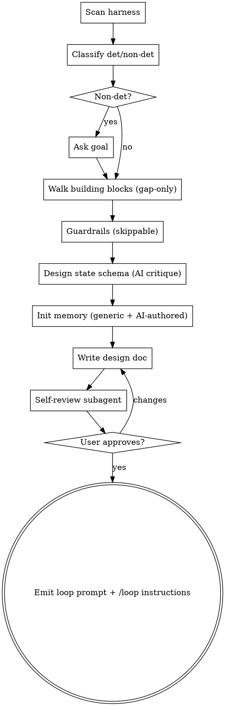

# loop-engineering skill — design spec

**Date:** 2026-06-17
**Status:** Approved (design phase)
**Type:** New global skill

---

## 1. Purpose

A global skill that helps a user turn a rough idea into a **full-context, detailed
loop-engineering prompt + goal**, ready to run via the built-in `/loop` skill.

The skill does NOT execute the loop. It produces:
1. A design document explaining the loop.
2. Goal-specific durable memory/state files.
3. A ready-to-run loop prompt the user pastes into `/loop`.

Human oversight stays foundational — the skill stops at an approval gate before any run.

**Location:** `~/.claude/skills/loop-engineering/` (global, project-agnostic).

---

## 2. Background & sources

Three sources inform the model. They overlap; memory/state is the connective tissue.

- **DamiDefi video** — "loop engineering": you design the system that prompts the
  agent. Defines the **5-step per-iteration loop** and **7 things to get right**.
- **loops.elorm.xyz** — concrete loop-prompt skeleton (`Start "<name>" loop. Goal…
  Max iterations… Between iterations run… Exit when… Self-pace…`).
- **github.com/cobusgreyling/loop-engineering** — the **5 building blocks + Memory**,
  safety levels (L1/L2/L3), human-gate + allowlist, durable state outside any
  conversation.

### The three reasoning layers

| Layer | Source | Role |
|---|---|---|
| 6 building blocks | cobus | primitives the loop is assembled from |
| 5-step loop | video | per-iteration runtime cycle |
| 7 things to get right | video | quality bar |

**6 building blocks**

| Block | Job in the loop |
|---|---|
| Automations / Scheduling | discovery + triage on a cadence |
| Worktrees | safe parallel execution isolation |
| Skills | persistent project knowledge |
| Plugins & Connectors (MCP) | reach into real tools |
| Sub-agents | maker / checker split |
| + Memory / State | durable spine outside any conversation |

**5-step loop (per iteration):** check state → decide → act → gather feedback → verdict.

**7 things to get right:** context management, feedback quality, verification gates,
termination condition, error handling, state across turns, cost/token budget.

---

## 3. Key decisions

| # | Decision | Choice |
|---|---|---|
| 1 | Run behavior | **Emit prompt only.** User runs via `/loop`. No auto-exec. Human gate stays. |
| 2 | Classification | **AI defines** deterministic vs non-deterministic. Non-det → ask the goal; if no measurable check → use **AI-as-judge** as the verification gate. |
| 3 | Harness scan | Collect **skills + MCP + hooks** (and git/worktree feasibility). JSON stdout. |
| 4 | 7-things walkthrough | **Smart gap-only** — prefill defaults from idea + scan, ask only what can't be inferred. |
| 5 | Placement / name | Global `~/.claude/skills/loop-engineering/`. |
| 6 | Env (worktree) | **Ask the user**: isolated git worktree, or current dir. |
| 7 | Memory | **AI critiques the goal and derives the minimal durable state** for that goal. NOT a fixed template. |
| 8 | Guardrails | After the 7 things, **ask the user for restrictions the loop must never cross** (forbidden paths/commands/actions). **Skippable.** |
| 9 | Scheduling | **Ask the user for a time/cadence** (interval or cron) **or skip → run as goal** (execute until done). Drives the run instructions emitted at the end. |

### Deterministic vs non-deterministic

- **Deterministic** — a clear pass/fail check exists (tests/build/lint exit 0, audit
  clean). Verification gate = the command exit code.
- **Non-deterministic** — fuzzy goal. Skill **asks for the goal**. If no measurable
  check can be derived, verification gate = **AI-as-judge** evaluating output against
  the stated goal.

---

## 4. Reuse from `superpowers/brainstorming`

Inspected. The visual-companion infra (`server.cjs`, `helper.js`,
`frame-template.html`, `start-server.sh`, `stop-server.sh`) is for rendering mockups
in a browser — **not needed** for a text/terminal skill. Reuse three things:

1. **Bash conventions** from `start-server.sh` → template `scan-harness.sh`:
   arg-parse loop, `umask 077` (skill/MCP paths may hold secrets), **JSON stdout**
   for clean parsing, explicit error-JSON on failure, cross-platform guards.
2. **`spec-document-reviewer-prompt.md`** → adapt into a loop-tuned
   `reference/loop-design-reviewer.md` subagent prompt.
3. **SKILL.md skeleton** — frontmatter + `<HARD-GATE>` + checklist + dot-graph flow.

---

## 5. File layout

```
~/.claude/skills/loop-engineering/
  SKILL.md                          # dialogue flow + HARD-GATE (no run until approved)
  scripts/scan-harness.sh           # JSON: { skills[], agents[], mcp[], hooks[], gitWorktreeCapable }
  scripts/init-memory.sh            # scaffold docs/loops-engineering/memory/<topic>/ (generic files only)
  reference/loop-patterns.md        # 6 blocks, 5-step, 7 things, det/non-det, safety levels, state rubric, prompt skeleton
  reference/loop-design-reviewer.md # loop-tuned subagent review prompt
```

Output artifacts (in the user's project, not the skill):

```
docs/loops-engineering/
  YYYY-MM-DD-<topic>.md             # the design doc for this loop
  memory/<topic>/
    run-log.md                      # generic: per-iteration audit + cost  (init-memory.sh)
    budget.md                       # generic: max iterations / token budget (init-memory.sh)
    guardrails.md                   # restrictions the loop must never cross (omitted if user skips)
    <ai-derived state files>        # goal-specific, AI-authored (e.g. STATE.md, queue.md, classifications.json)
```

---

## 6. Dialogue flow

Brainstorming-style: one question at a time, multiple-choice when possible, gap-only.



### Steps

1. **Scan harness** — run `scan-harness.sh`; get skills/MCP/hooks + worktree feasibility.
2. **Classify** — AI defines det vs non-det. Non-det → ask the goal; no measurable
   check → AI-judge gate.
3. **Walk the 6 building blocks, ask only gaps:**

   | Block | Skill asks / infers |
   |---|---|
   | Automations/Scheduling | **ask for a time/cadence (interval or cron), or skip → run as goal (until done).** Determines run mode below. |
   | **Worktrees** | **ask: isolated git worktree, or current dir** |
   | Skills | which scanned skills to leverage (prefill from scan) |
   | Plugins/MCP | which scanned MCP servers to use (prefill from scan) |
   | Sub-agents | maker/checker split? (default on for non-trivial) |
   | + Memory/State | handled in step 4 |

   Plus 7-things gaps: verification gate, termination condition, error handling,
   cost/budget.

3a. **Guardrails / restrictions (skippable)** — after the 7 things, ask the user for
   hard rules the loop must **never** cross: forbidden paths (e.g. migrations, prod
   config), forbidden commands (e.g. `git push origin main`, `rm -rf`), forbidden
   actions (e.g. deleting data, calling paid APIs). User may **skip**. Captured rules
   become the loop's non-negotiable boundary — distinct from the verification gate
   (which checks *done*); guardrails check *not allowed*. Stored in
   `memory/<topic>/guardrails.md` and embedded as a hard-constraint clause in the
   emitted prompt.

4. **Design state schema (AI critique)** — AI reasons: *what must persist so the next
   iteration/agent knows where things stand?* Derives the minimal state for THIS goal
   using the rubric below.
5. **Init memory** — `init-memory.sh` creates the dir + generic `run-log.md` and
   `budget.md`. The AI then **authors goal-specific state file(s)** with Write.
6. **Write design doc** → `docs/loops-engineering/YYYY-MM-DD-<topic>.md`.
7. **Self-review** — dispatch `loop-design-reviewer` subagent.
8. **Approval gate** — user reviews; on approval, **emit the loop prompt** + `/loop`
   instructions. (HARD-GATE: nothing runs before this.)

---

## 7. State-derivation rubric

Persist a fact only if ALL hold:
- (a) **Needed to resume** — without it the next iteration can't continue correctly.
- (b) **Not recoverable** from the repo, git, or a tool call.
- (c) **Changes across iterations** — static config belongs in the prompt, not state.

YAGNI on state. Prefer the smallest schema that survives a context reset.

**Worked examples**

| Goal | Derived state |
|---|---|
| PR babysitter | open-PR list + last-seen SHA per PR |
| Flaky-test triage | per-test `{ runs, pass, fail, verdict }` |
| Migration sweep | files done / files remaining |
| Daily triage | last-run timestamp + already-triaged item IDs |

`run-log.md` (audit + cost) and `budget.md` (iterations/budget) are generic and
always created — they are not "derived" state.

---

## 8. Emitted loop prompt skeleton

```
Start "<name>" loop. Type: <deterministic | non-deterministic>. Goal: <end state>.
Env: <worktree <path> | current dir>.
Memory: read docs/loops-engineering/memory/<topic>/<state-files> before each pass;
        update them after each pass.
Max iterations: N. Budget: see budget.md.

Each pass (5 steps):
 1. Check state — read <state files> + run <check cmd>.
 2. Decide the next action.
 3. Act — implementer sub-agent; use skills [<…>], MCP [<…>].
 4. Verify — checker sub-agent / <check cmd> / AI-judge vs goal.
 5. Verdict — update <state files> + run-log.md. Continue only if exit not met.

Exit when: <condition>. On tool failure: <error handling>.
Guardrails — NEVER: <forbidden paths/commands/actions>. If a step would cross one,
        stop and escalate instead. (Omitted if the user skipped guardrails.)
Human gate: escalate <risky actions> with full context; auto-proceed only on <allowlist>.
Safety level: L1 report-only | L2 assisted | L3 unattended.
Give a short status update each pass.
```

The concrete files, skills, MCP, check command, env, and gate are all filled from the
dialogue — nothing is hardcoded.

### Run mode (from the Scheduling step)

The skill emits run instructions matching the user's scheduling choice:

- **Scheduled** (user gave a time/cadence) — run on a cadence:
  - interval → `/loop <interval> <prompt>` (e.g. `/loop 15m …`)
  - cron / specific time → `/schedule` a routine with the prompt.
- **Run as goal** (user skipped scheduling) — self-paced, run until the exit
  condition: `/loop <prompt>` (no interval).

The emitted prompt body is identical in both modes; only the run instruction differs.

---

## 9. Scripts

### `scripts/scan-harness.sh`
- Reads `~/.claude/skills` + `<project>/.claude/skills` → skill names + descriptions.
- Reads `~/.claude/agents` + `<project>/.claude/agents` → sub-agent names + descriptions.
- Reads MCP servers from settings (`~/.claude.json` / settings files).
- Reads hooks from settings.
- Detects whether cwd is a git repo (→ `gitWorktreeCapable`).
- **Output:** single JSON object on stdout: `{ skills[], agents[], mcp[], hooks[], gitWorktreeCapable }`.
- `umask 077`; error path prints `{"error": "..."}` and exits non-zero.

### `scripts/init-memory.sh`
- Arg: `--topic <slug>` (+ optional `--project-dir`).
- Creates `docs/loops-engineering/memory/<topic>/`.
- Writes generic `run-log.md` and `budget.md` skeletons only.
- Does **not** write domain state — the AI authors those.
- Output: JSON `{ memoryDir, created[] }`.

---

## 10. Safety

- **HARD-GATE** in SKILL.md: no loop runs and no prompt is emitted until the user
  approves the design.
- Phased rollout in the design doc: **L1 report-only → L2 assisted → L3 unattended**.
- Emitted prompt always includes a **human gate + allowlist** clause.
- Cost caveat surfaced: loops are token-heavy; `budget.md` + max-iterations bound them.

---

## 11. Out of scope (YAGNI)

- No web/visual companion server.
- No auto-execution, no cron/hook installation by the skill.
- No npm CLIs (`loop-init`/`loop-audit`/`loop-cost`) — the skill replaces them with
  in-context reasoning + two bash scripts.
- Multi-loop orchestration in one run — one loop per invocation.

---

## 12. Verification (definition of done for building the skill)

- [ ] `scan-harness.sh` returns valid JSON on this repo (skills/MCP/hooks/git).
- [ ] `init-memory.sh --topic demo` creates the memory dir + generic files.
- [ ] Dry-run the dialogue on a deterministic example (e.g. "keep tests green") →
      produces design doc + AI-derived state + runnable prompt.
- [ ] Dry-run a non-deterministic example (e.g. "improve README clarity") → AI-judge
      gate present, goal captured.
- [ ] `loop-design-reviewer` subagent flags a deliberately broken design (missing
      termination).
- [ ] HARD-GATE holds: nothing emitted before approval.
- [ ] Guardrails step: user-provided rules land in `guardrails.md` + a `NEVER:` clause
      in the emitted prompt; skipping omits both cleanly.
```
