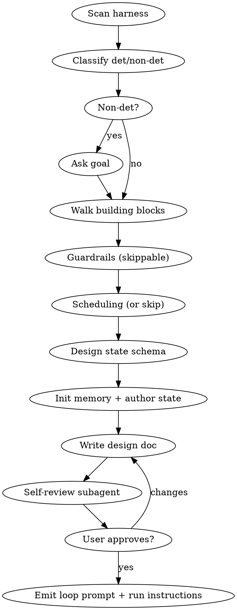

# Loop Engineer

Turn a rough idea into a **full-context, detailed loop** — a ready-to-run prompt + goal,
backed by durable memory. You design the system that prompts the agent; you do not run it.

Reference (read before the dialogue): `reference/loop-patterns.md`.

<HARD-GATE>
Do NOT emit the final loop prompt, run anything, install any hook/cron, or invoke /loop
or /schedule until you have presented the design and the user has approved it. The skill
produces a design + memory + prompt; the human decides when it runs.
</HARD-GATE>

## Checklist

Create a todo per item and complete them in order:

1. **Scan harness** — run `scripts/scan-harness.sh`.
2. **Classify** the loop — deterministic vs non-deterministic.
3. **Walk the building blocks** — gap-only questions, one at a time.
4. **Guardrails** — ask for restrictions the loop must never cross (skippable).
5. **Scheduling** — ask for a time/cadence, or skip → run as goal.
6. **Design state schema** — critique the goal, derive the minimal state.
7. **Init memory** — run `scripts/init-memory.sh`, then author goal-specific state files.
8. **Write design doc** — `docs/loops-engineering/YYYY-MM-DD-<topic>.md`.
9. **Self-review** — dispatch the `reference/loop-design-reviewer.md` subagent.
10. **Approval gate** — present design; on approval, emit the loop prompt + run instructions.

## Flow

## Steps in detail

### 1. Scan harness
Run `scripts/scan-harness.sh --project-dir <project>`. It returns JSON:
`{ skills[], agents[], mcp[], hooks[], gitWorktreeCapable }`. Use it to prefill which
skills/sub-agents/MCP the loop can leverage and whether a worktree env is feasible.

### 2. Classify
Read the idea and **define** det vs non-det (see `loop-patterns.md` §5).
- Deterministic → a real pass/fail check exists (tests/build/lint/audit).
- Non-deterministic → **ask the user for the goal**; if no measurable check can be
  derived, the verification gate is **AI-as-judge** against that goal.
State your classification and reasoning so the user can override.

### 3. Walk the building blocks (gap-only)
One question at a time, multiple-choice when possible. Prefill from the scan + idea; ask
ONLY what you can't infer.

| Block | Ask / infer |
|---|---|
| Scheduling | (handled in step 5) |
| **Worktree** | **ask: isolated git worktree, or current dir** (only offer worktree if `gitWorktreeCapable`) |
| Skills | which scanned skills to leverage (prefill) |
| MCP | which scanned MCP servers to use (prefill) |
| Sub-agents | maker/checker split? default ON for non-trivial loops. Prefer reusing scanned `agents[]` for the implementer/checker roles when a fit exists |

Also resolve 7-things gaps: verification gate, termination condition + max iterations,
error handling, cost/budget.

### 4. Guardrails (skippable)
Ask the user for hard rules the loop must **never** cross — forbidden paths (migrations,
prod config), forbidden commands (`git push origin main`, `rm -rf`), forbidden actions
(deleting data, paid API calls). User may skip. This is distinct from the verification
gate: gate = *done?*, guardrails = *allowed?* (see `loop-patterns.md` §6).

### 5. Scheduling (or skip)
Ask for a time/cadence (interval like `15m`, or a cron/specific time), **or skip → run as
goal** (self-paced until done). This drives the run instruction emitted at the end
(`loop-patterns.md` §8).

### 6. Design state schema
Critique the goal: *what must persist so the next iteration/agent knows where things
stand after a context reset?* Apply the rubric (`loop-patterns.md` §7). Keep it minimal.

### 7. Init memory + author state
Run `scripts/init-memory.sh --topic <topic> --project-dir <project>`. It creates the
memory dir + generic `run-log.md` and `budget.md`. Then **you author** the goal-specific
state file(s) with Write (e.g. `STATE.md`, `queue.md`, `classifications.json`) matching
your schema. If guardrails were given, write `guardrails.md`. Fill the real
max-iterations/budget into `budget.md`.

### 8. Write design doc
Write `docs/loops-engineering/YYYY-MM-DD-<topic>.md` covering: classification + why, goal,
building-block choices, env, the 7 things, guardrails, scheduling/run mode, the derived
state (with file list), and the assembled loop prompt.

### 9. Self-review
Dispatch the subagent from `reference/loop-design-reviewer.md`. Fix any blocking issues
inline before presenting.

### 10. Approval gate → emit
Present the design. On approval ONLY, emit:
- the filled loop-prompt skeleton (`loop-patterns.md` §11), and
- the run instruction for the chosen mode (`loop-patterns.md` §8) — e.g.
  `/loop 15m <prompt>`, a `/schedule` routine, or self-paced `/loop <prompt>`.

Tell the user they can review the doc + memory files, then run it themselves.

## Principles
- One question at a time; multiple-choice preferred; ask only gaps.
- YAGNI on state and features.
- The human runs the loop. The skill stops at the approval gate.
